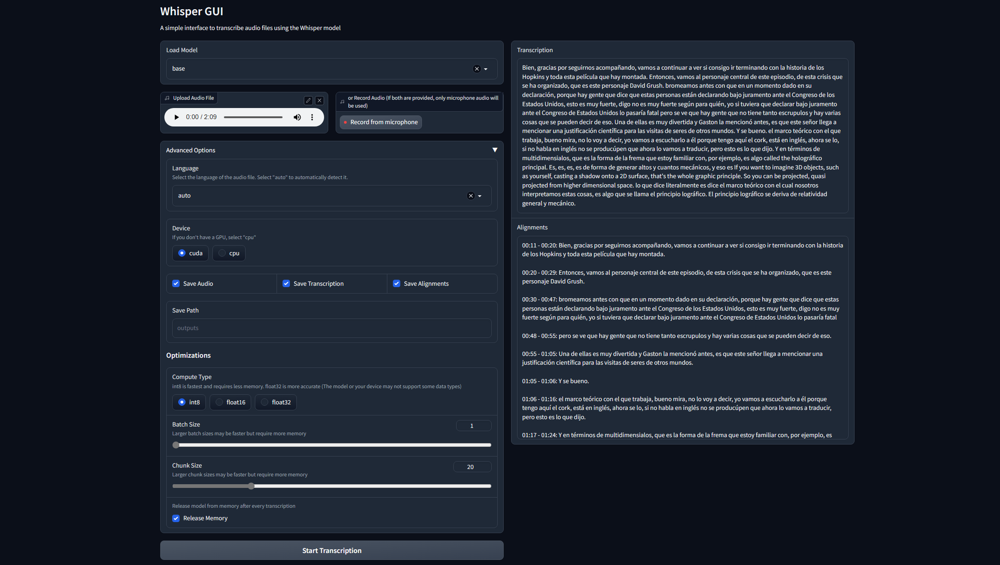

# Whisper-GUI
A simple GUI made with `gradio` to use WhisperX on Windows.  

## Requirements
- [Anaconda](https://docs.anaconda.com/free/anaconda/install/windows/) installed and `conda` added to PATH.
- `git` installed and added to PATH.

## Set up
- Run the `whisper-gui.bat` file and follow the instructions. After the process, it will run the GUI in a new browser tab.

Otherwise, manual steps are:
- **Create a conda environment with Python 3.10**  
	`conda create --name whisperx python=3.10`  
	`conda activate whisperx`
- **Install PyTorch 2.0**  
	If you have GPU:  
	`conda install pytorch==2.0.0 torchaudio==2.0.0 pytorch-cuda=11.8 -c pytorch -c nvidia`  
	If not, for CPU:  
	`conda install pytorch==2.0.0 torchaudio==2.0.0 cpuonly -c pytorch`
- **Install whisperx**  
	`pip install git+https://github.com/m-bain/whisperx.git`  
	Original instructions in: https://github.com/m-bain/whisperX
- **Install necessary libraries**  
	`pip install gradio`  
- **Clone this repository**  
	`git clone https://github.com/Pikurrot/whisper-gui`

## Run the GUI
To run the program every time, you can just run the same `whisper-gui.bat`, which will also automatically check for updates of this repo.  
Your transcriptions will be saved by default in the `outputs` folder of the repo.

Otherwise, to run manually:  
`conda activate whisperx`  
`python main.py --autolaunch`

## Future updates
- Allow selection of customm downloaded models
- Real-time voice transcription
- Speaker-diarization
- Subtitle creation for videos
- Automatic setup for Linux / Mac
