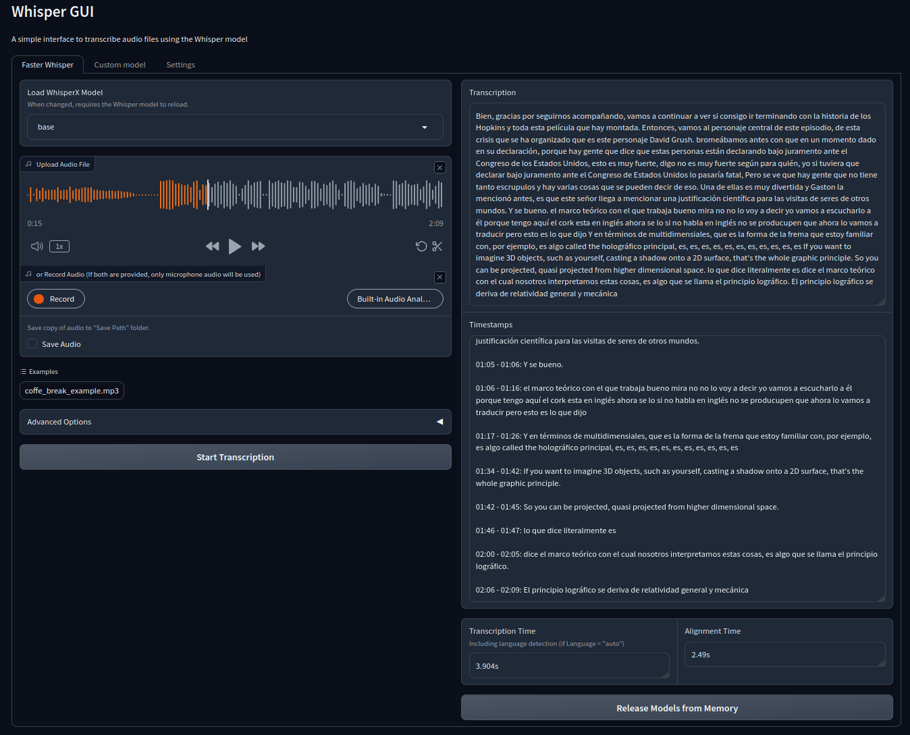

# Whisper-GUI


<div align="center">

[](https://github.com/Pikurrot/whisper-gui/stargazers)
[](https://github.com/Pikurrot/whisper-gui/releases/latest)


*A simple GUI made with `gradio` to use Whisper.*

</div>

## ✨ Features
- 📁 Transcribe local **audio and video** files
- 🌍 Automatic or manual **language detection**
- ⏱️ Word & sentence-level **timestamps**
- 💾 **Multiple output formats**: SRT, JSON, TXT
- 🤖 Supports multiple State-of-the-art **Whisper & WhisperX** models
- ⚙️ Advanced and customizable transcription options & **optimizations**

### Coming soon
- 👥 Speaker diarization
- 📚 Mass transcription

---


## 🚀 Quick start (Binaries - recommended)
Download the corresponding binary files from the [**Releases**](https://github.com/Pikurrot/whisper-gui/releases) page.
| OS                | Variant  | Download                                 | Extra prerequisite                                                                        | How to run                                                                                                                      |
| ----------------- | -------- | ---------------------------------------- | ----------------------------------------------------------------------------------------- | ------------------------------------------------------------------------------------------------------------------------------- |
| **Windows 10/11** | **CPU**  | `WhisperGUI-cpu-win64.exe`               | –                                                                                         | Double-click                                                                                                                    |
|                   | **CUDA** | `WhisperGUI-cuda-win64.7z.001` + `.002`  | 1. **7-Zip**<br>2. NVIDIA drivers                                                  | - Place both parts together<br>- Right-click the `.001` → <br>  *7-Zip ▸ Extract Here*<br>- Run `WhisperGUI-cuda-win64.exe`         |
| **Linux x86-64**  | **CPU**  | `WhisperGUI-cpu-x86_64.AppImage`         | –                                                                     | - `chmod +x WhisperGUI-cpu-x86_64.AppImage`<br> - `./WhisperGUI-cpu-x86_64.AppImage`                                                                                                                               |
|                   | **CUDA** | `WhisperGUI-cuda-x86_64.7z.001` + `.002` | 1. **7-Zip** (`sudo apt install p7zip-full`)<br>2. NVIDIA drivers<br> | - `cat *.7z.* > all.7z && 7z x all.7z`<br>- `chmod +x WhisperGUI-cuda-x86_64.AppImage`<br>- `./WhisperGUI-cuda-x86_64.AppImage` |


Your transcriptions will be saved by default in the `outputs` folder of the repository.

> **Note**: Binaries are in ***alpha*** stage.  
> **Not yet available**: macOS and AMD GPU builds. Use the alternative installation methods.

## 🛠️ Alternative Installation Methods
### Requirements
- [Anaconda](https://docs.anaconda.com/free/anaconda/install/) or [Miniconda](https://docs.conda.io/projects/miniconda/en/latest/) installed and `conda` added to PATH.
- `git` installed and added to PATH. See [instructions](https://git-scm.com/book/en/v2/Getting-Started-Installing-Git).
- `ffmpeg` installed and added to PATH. See instructions for [Windows](https://phoenixnap.com/kb/ffmpeg-windows), [Linux](https://phoenixnap.com/kb/install-ffmpeg-ubuntu) or [macOS](https://phoenixnap.com/kb/ffmpeg-mac).

### 1. Interactive Wizard (stable)
In **Windows**, run the `whisper-gui.bat` file.  
In **Linux / macOS** run the `whisper-gui.sh` file.  
Follow the instructions and let the script install the necessary dependencies. After the process, it will run the GUI in a new browser tab.  

To run the program every time, you can just run the same `whisper-gui.bat` or `whisper-gui.sh` (whatever your OS), which will also automatically check for updates of this repository.

### 2. Manual — Advanced Users
- **Create a conda environment with Python 3.10**  
	```bash
	conda create --name whisperx python=3.10
	conda activate whisperx
	```
- **Install PyTorch 2.0**  
	For macOS:  
	```bash
	conda install pytorch::pytorch==2.0.0 torchaudio==2.0.0 -c pytorch
	```
	For Windows or Linux, if you have Nvidia GPU:  
	```bash
	conda install pytorch==2.0.0 torchaudio==2.0.0 pytorch-cuda=11.8 -c pytorch -c nvidia
	```
	For Linux, if you have AMD GPU:  
	```bash
	pip install torch==2.0.0 torchaudio==2.0.0 --index-url https://download.pytorch.org/whl/rocm6.0`
	```
	If not, install for CPU:  
	```bash
	conda install pytorch==2.0.0 torchaudio==2.0.0 cpuonly -c pytorch
	```
- **Install whisperx and dependecies**  
	```bash
	pip install git+https://github.com/m-bain/whisperx.git
	```
	>Original instructions in: https://github.com/m-bain/whisperX
- **Install additional libraries**  
	```bash
	pip install gradio
	```
- **Clone this repository**  
	```bash
	git clone https://github.com/Pikurrot/whisper-gui
	```
- **Run the GUI**  
	```bash
	conda activate whisperx
	python main.py --autolaunch
	```

## 🐳 Docker
### Container (CPU only for now)
To run this software in a docker container, visit this [dockerhub project](https://hub.docker.com/r/3x3cut0r/whisper-gui).  
Thank you [3x3cut0r](https://hub.docker.com/u/3x3cut0r)!

### Docker-compose
Simply run the following command in the repository root:
```bash
docker-compose up -d
```
Thank you [MarkAC007](https://github.com/MarkAC007)!

## Licensing
This project is primarily distributed under the terms of the MIT License. See the [LICENSE](LICENSE) file for details.

**Third-Party Code**  
Portions of this project incorporate code from [WhisperX](https://github.com/m-bain/whisperX), which is licensed under BSD-4-Clause license. This code is used in accordance with its license, and the full text of the license can be found within the relevant [source files](scripts/whisper_model.py).
